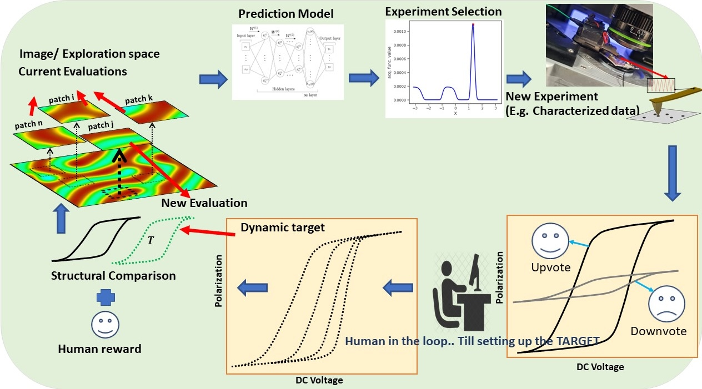

# BOARS_web

**MAC USERS** - Refer to the "MAC_Instructions.md"

## Demo Video

## Problem Description

Build a partial human-in-the-loop Bayesian Optimization (BO) framework.

Here, we have image data where X is the input location of the image. Each location in the image has spectral data, from which users can select if the data is good or bad (discrete choices). We generate the target spectral to explore from the weighted average of all the user-chosen spectral.

At the mid-point of execution, the user has the option to either eliminate (or update preferences for) all the previously stored spectral if the user suddenly discovers a desired spectral and wants to assign more weight to the newly found spectral.

The goal is to build an optimization (BO) model that adaptively samples towards the regions (in the image) of good spectral, and finds the optimal location point closest to the current chosen target spectral (based on user voting).

The figure below is adapted from [Biswas et al. (2024)](https://doi.org/10.1038/s41524-023-01191-5). Please cite our paper if you use this tool in your research.

### References
- [1] Biswas, A., Liu, Y., Creange, N. et al. A dynamic Bayesian optimized active recommender system for curiosity-driven partially Human-in-the-loop automated experiments. *npj Comput Mater* **10**, 29 (2024). [Link to the article](https://doi.org/10.1038/s41524-023-01191-5)
